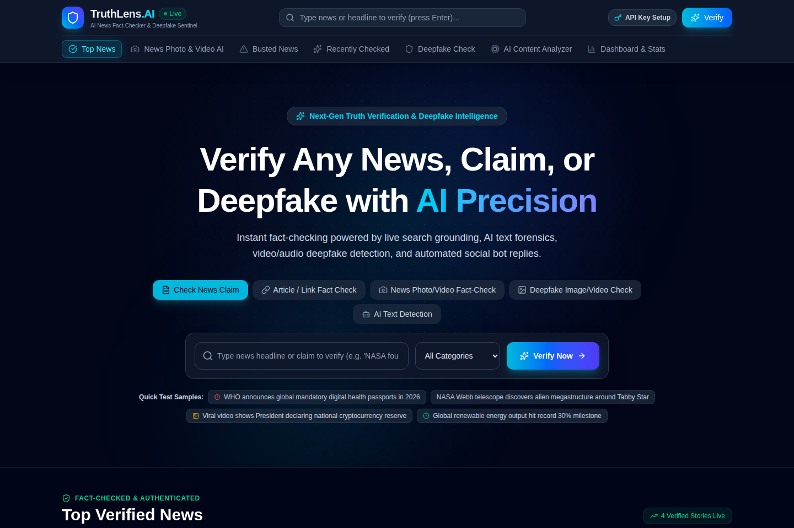
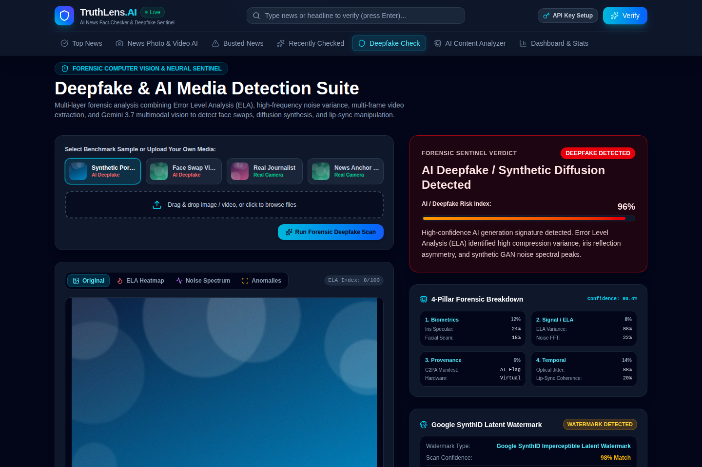
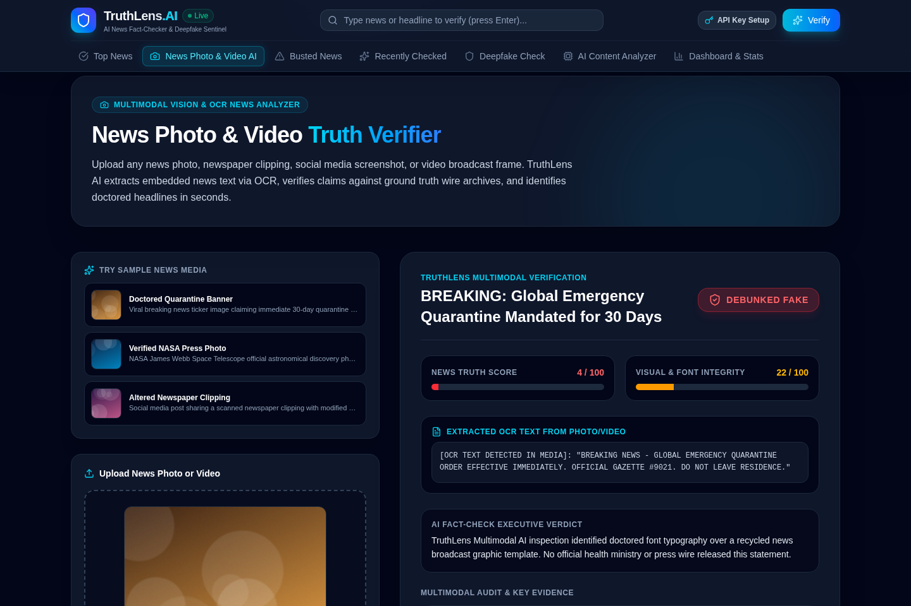
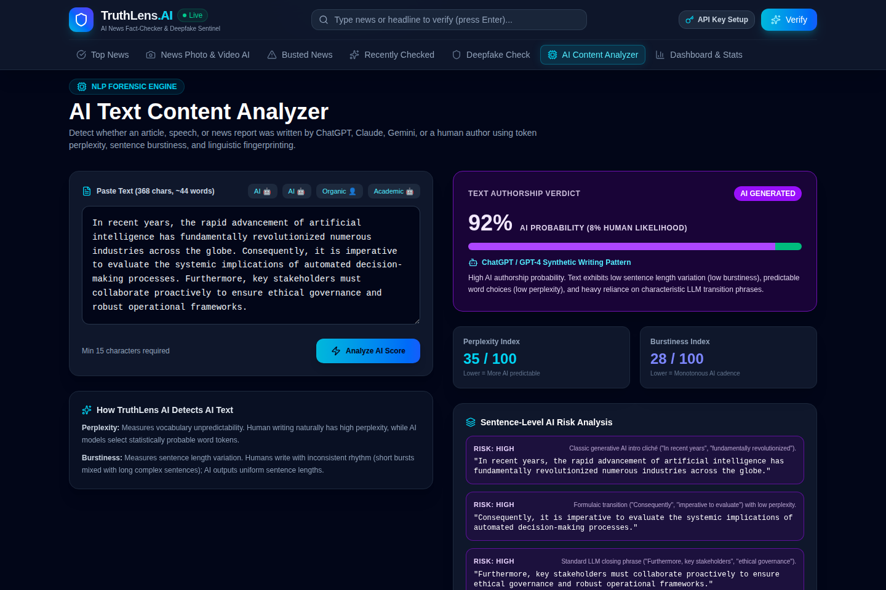
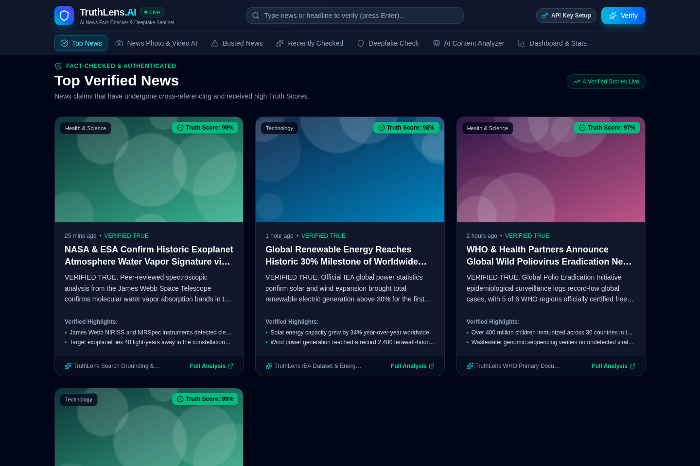
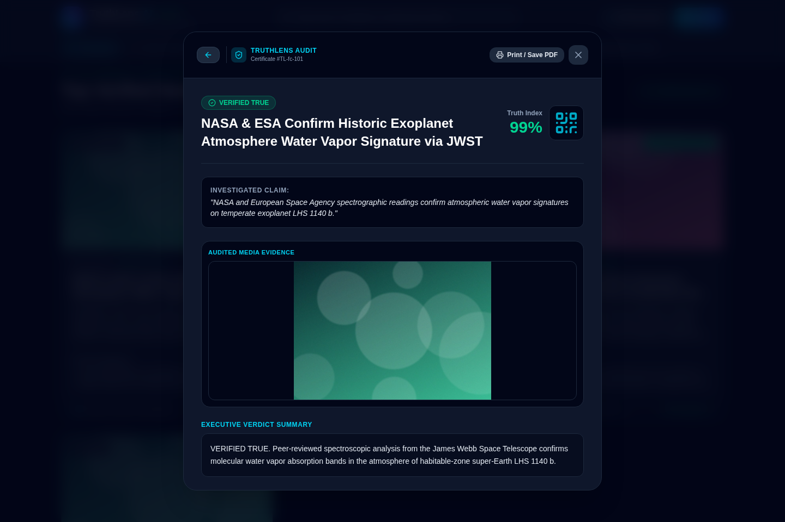
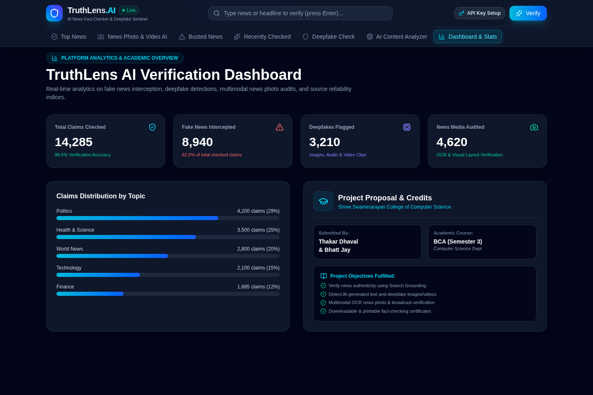
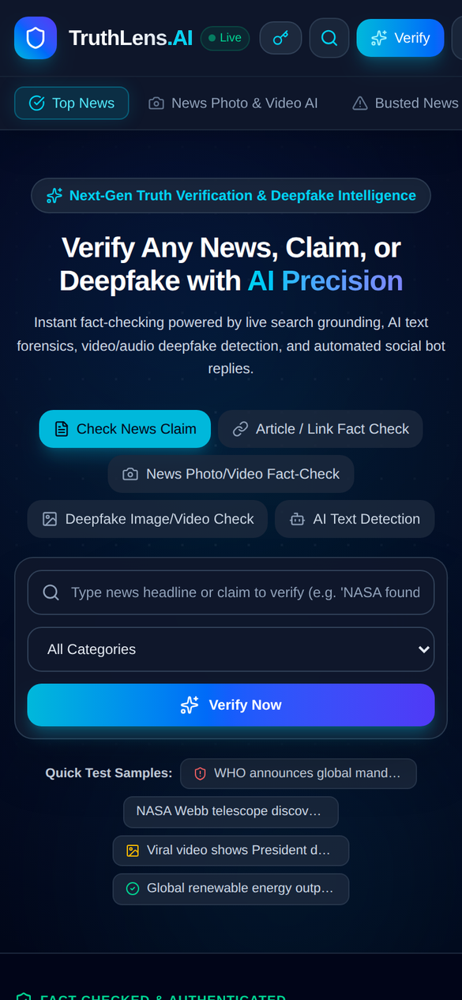
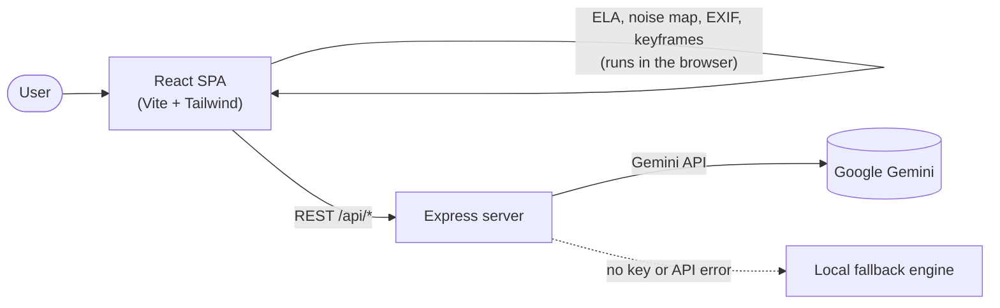

<div align="center">


# TruthLens AI

### AI-powered news fact-checker, deepfake detector & AI-text sentinel

*Paste a claim, upload a photo or video, or drop in an article — and see what's real.*

<br />


[**Preview**](#-preview) ·
[**Features**](#-features) ·
[**How it works**](#-how-it-works) ·
[**Getting started**](#-getting-started) ·
[**API**](#-api-reference) ·
[**Team**](#-team)

</div>

---

## 📖 About

**TruthLens AI** is a single-page web platform that helps people separate fact from fiction online. It brings three kinds of verification into one dashboard:

- 📰 **Fact-check** news claims and article links
- 🖼️ **Inspect** photos, news clippings and videos for manipulation and deepfakes
- ✍️ **Detect** whether a piece of text was written by a human or an AI

Analysis is powered by **Google Gemini** on the backend, combined with **forensic image analysis that runs directly in your browser**. Every result can be opened as a printable **audit certificate** and exported to PDF.

---

## 📸 Preview

<div align="center">



<sub>The home screen: verify a claim, link, photo, video or piece of text from one search box.</sub>

</div>

<br />

<table>
  <tr>
    <td width="50%" align="center">
      
      <br /><b>🕵️ Deepfake Detection Suite</b>
      <br /><sub>Risk index, four-pillar breakdown and SynthID scan</sub>
    </td>
    <td width="50%" align="center">
      
      <br /><b>📸 News Photo &amp; Video Verifier</b>
      <br /><sub>OCR text extraction, truth score and visual integrity</sub>
    </td>
  </tr>
  <tr>
    <td width="50%" align="center">
      
      <br /><b>🧠 AI Text Analyzer</b>
      <br /><sub>Perplexity, burstiness and sentence-level risk</sub>
    </td>
    <td width="50%" align="center">
      
      <br /><b>✅ Verified News Feed</b>
      <br /><sub>Truth-scored stories with highlights and sources</sub>
    </td>
  </tr>
  <tr>
    <td width="50%" align="center">
      
      <br /><b>🧾 Audit Certificate</b>
      <br /><sub>Unique ID, QR code and Print / Save as PDF</sub>
    </td>
    <td width="50%" align="center">
      
      <br /><b>📊 Analytics Dashboard</b>
      <br /><sub>Platform stats and claims by topic</sub>
    </td>
  </tr>
</table>

<div align="center">

<br />



<br />

<sub><b>📱 Fully responsive</b> — the whole platform works on phones and tablets.</sub>

</div>

---

## ✨ Features

| | Module | What it does |
|---|---|---|
| 🔎 | **Claim & URL Fact-Checker** | Verifies a claim or article link and returns a verdict (`VERIFIED_TRUE`, `DEBUNKED_FAKE`, `MISLEADING`, `UNVERIFIED`), a 0–100 truth score, key findings and rated sources. |
| 📸 | **News Photo & Video Verifier** | Multimodal OCR pulls out headlines, tickers and captions from clippings and broadcast frames, checks the visual layout for doctoring, and compares the claim against wire-service style sources. |
| 🕵️ | **Deepfake & Synthetic Media Sentinel** | A four-pillar forensic suite (see below) with ELA heatmaps, noise maps, EXIF/C2PA provenance checks and per-frame video analysis. |
| 🧠 | **AI Text Analyzer** | Scores text for AI vs. human authorship using perplexity and burstiness, predicts the likely model, and highlights each sentence with an AI-likelihood tag and reason. |
| 🚨 | **Busted News & Recent Feed** | A dedicated section for debunked hoaxes plus a filterable, real-time feed of every claim checked. |
| 📊 | **Analytics Dashboard** | Cards and category breakdowns for claims checked, fake news busted, deepfakes flagged and media audited. |
| 🧾 | **Audit Certificates** | Each report opens as a certificate with a unique ID and QR code, ready to print or save as PDF. |
| 🔑 | **Bring-your-own API key** | Add your Gemini key from the UI, validate it live, and start using it — no server restart needed. |

### The four pillars of deepfake detection

| # | Pillar | Signals inspected |
|---|---|---|
| 1 | **Biometric mechanics** | Iris symmetry, facial boundary blend seams, skin micro-texture, lip-sync coherence |
| 2 | **Digital signal** | Client-side Error Level Analysis (ELA) heatmap, Laplacian edge/noise variance, GAN spectral artifacts |
| 3 | **Provenance & hardware** | EXIF tags, camera hardware vs. generative signatures, C2PA manifest status, SynthID watermark scan |
| 4 | **Temporal & motion** | Video keyframe extraction with a per-timestamp AI-probability score |

---

## 🧩 How it works



1. The **React front end** collects the claim, text or media. For images and video it first runs forensic checks locally (ELA, Laplacian noise variance, EXIF header parsing, keyframe extraction).
2. The **Express server** forwards the request to Gemini with a task-specific system prompt and asks for structured JSON. It tries a chain of Gemini Flash models, so a single model failing doesn't break the request.
3. If no API key is set, or the API is unreachable, a **local fallback engine** returns a heuristic result so the app keeps working (see [Notes & limitations](#-notes--limitations)).
4. Results appear in the feed and dashboard and can be opened as an **audit certificate**.

---

## 🧰 Tech stack

| Layer | Technology |
|---|---|
| **Front end** | React 19, TypeScript, Tailwind CSS 4, Motion (animations), Lucide icons |
| **Build tool** | Vite 6 (code-split vendor chunks), esbuild for the server bundle |
| **Back end** | Node.js, Express 4, dotenv |
| **AI** | Google Gemini via the `@google/genai` SDK |
| **Browser forensics** | Canvas API (ELA, Laplacian filter, video keyframes) |

---

## 🚀 Getting started

### Prerequisites

- **Node.js 18+** (Node 20 LTS recommended)
- A free **Gemini API key** from [Google AI Studio](https://aistudio.google.com/app/apikey)

### 1. Install

```bash
git clone https://github.com/<your-username>/truthlens-ai.git
cd truthlens-ai
npm install
```

### 2. Configure

Copy the example environment file and add your key:

```bash
cp .env.example .env
```

```env
GEMINI_API_KEY="your_gemini_api_key_here"
PORT=3000
```

> 💡 You can also skip this step and paste your key into the app through the **API Key** button in the top bar.

### 3. Run in development

```bash
npm run dev
```

Open **http://localhost:3000**. The dev command starts the Express server with Vite running as middleware, so the front end and API share one port.

### 4. Build & run for production

```bash
npm run build
```

Then start the compiled server with `NODE_ENV` set to `production`:

```bash
# macOS / Linux
NODE_ENV=production npm start

# Windows (PowerShell)
$env:NODE_ENV="production"; npm start
```

### Available scripts

| Command | Description |
|---|---|
| `npm run dev` | Start the dev server (Express + Vite middleware) |
| `npm run build` | Build the front end into `dist/` and bundle the server to `dist/server.cjs` |
| `npm start` | Run the compiled production server |
| `npm run preview` | Preview the Vite front-end build only |
| `npm run lint` | Type-check the project with `tsc --noEmit` |
| `npm run clean` | Remove build output |

---

## 🔌 API reference

All routes are served by the Express backend. Gemini-backed routes read the API key from the `x-gemini-api-key` header, then the request body, then the `GEMINI_API_KEY` environment variable.

| Method | Endpoint | Purpose |
|---|---|---|
| `GET` | `/api/feed` | Returns the fact-check feed and platform stats |
| `POST` | `/api/verify-api-key` | Tests a Gemini API key with a small ping request |
| `POST` | `/api/fact-check` | Fact-checks a claim or URL `{ claim, url, category }` |
| `POST` | `/api/analyze-text` | AI vs. human authorship analysis `{ text }` (min. 15 characters) |
| `POST` | `/api/detect-deepfake` | Deepfake and manipulation analysis for an image or video frame |
| `POST` | `/api/fact-check-media` | OCR and veracity check for news photos and video frames |

Request bodies accept up to **80 MB**, which is also the upload limit in the UI.

---

## 📁 Project structure

```text
truthlens-ai/
├── server.ts                  # Express API + Gemini integration + local fallback
├── vite.config.ts             # Vite, Tailwind and chunk-splitting config
├── index.html                 # App shell
├── public/
│   └── favicon.svg            # Shield logo
├── assets/
│   ├── logo.svg               # README logo
│   └── screenshots/           # README preview images
├── src/
│   ├── main.tsx               # React entry point
│   ├── App.tsx                # State hub and tab routing
│   ├── types.ts               # Shared TypeScript types
│   ├── index.css              # Tailwind import, scrollbar and print styles
│   ├── components/
│   │   ├── Navbar.tsx                 # Sticky header, search, tab navigation
│   │   ├── HeroBanner.tsx             # Search hero with mode switcher and sample claims
│   │   ├── TopNewsSection.tsx         # Verified news feed
│   │   ├── BustedNewsSection.tsx      # Debunked hoaxes
│   │   ├── RecentlyCheckedSection.tsx # Filterable chronological feed
│   │   ├── NewsMediaFactChecker.tsx   # Photo / video OCR verifier
│   │   ├── DeepfakeDetector.tsx       # Four-pillar forensic suite
│   │   ├── AITextAnalyzer.tsx         # NLP authorship analysis
│   │   ├── DashboardStats.tsx         # Analytics dashboard
│   │   ├── FactCheckModal.tsx         # Audit certificate + print/PDF export
│   │   ├── ApiKeyModal.tsx            # Gemini key settings
│   │   └── Footer.tsx
│   ├── data/mockData.ts       # Seed feed and starting stats
│   └── utils/forensicVision.ts# ELA, noise map, keyframes, EXIF parsing
├── .env.example
└── package.json
```

---

## ⚠️ Notes & limitations

TruthLens AI is currently an **alpha-stage academic project**. A few things to know:

- **Fallback mode is a demo, not a verifier.** Without a working API key, results come from keyword and statistical heuristics, not real fact-checking. With a valid key, results come from Gemini.
- **AI output can be wrong.** Verdicts, AI-text scores and deepfake probabilities are estimates. Please double-check anything important against primary sources.
- **Seeded data.** The starting feed and dashboard numbers come from `src/data/mockData.ts`; they are sample data, not live statistics.
- **In-memory storage.** The feed and stats live in server memory and reset when the server restarts. There is no database yet.
- **Your API key.** A key entered in the UI is saved in your browser's `localStorage` and sent to your own server with each request. Keep `.env` out of version control (the included `.gitignore` already does).

---

## 🗺️ Roadmap

- [x] Claim and URL fact-checking
- [x] Multimodal news photo and video verification
- [x] Four-pillar deepfake detection with client-side forensics
- [x] AI text authorship analyzer
- [x] Printable audit certificates
- [ ] Persistent database for the fact-check feed
- [ ] Live web-search grounding with cited source links
- [ ] User accounts and saved history
- [ ] Multi-language support

---

## 👥 Team

Developed by:

| Name | Role |
|---|---|
| **Thakar Dhaval Ajaykumar** | Developer |
| **Bhatt Jay Ashokkumar** | Developer |
| **Mr. Gaurang Bhatt** | Mentor |
| **Ms. Avni Gondaliya** | Mentor |

🎓 BCA Semester 3 · **Shree Swaminarayan Gurukul College of Computer Science - Bhavnagar**

---

<div align="center">

**Built with 💙 to make the internet a little more truthful.**

⭐ If you find this project useful, consider giving it a star!

</div>
